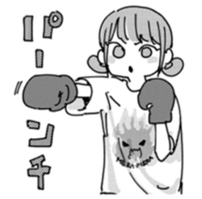

<!-- Header Banner -->

<!-- Profile Title Overlay -->

<h1 style="margin-top: -50px; color: #8B7BA3; text-shadow: 2px 2px 4px rgba(0,0,0,0.3);">
🌟 UeharaS
</h1>

<b>Backend Engineer | Cloud Specialist</b>

  

<!-- Typing Animation -->

  

<!-- Profile Cards Row -->
<table>
<tr>
<td width="50%" valign="top">

### 📊 GitHub Analytics

</td>
<td width="50%" valign="top">

### 🏆 Achievements

</td>
</tr>
</table>

 

<!-- Tech Stack Section -->

<h3>🛠️ Tech Stack & Expertise</h3>

 

<!-- Programming Languages -->
<table>
<tr>
<td align="center" style="border: none;">

 <b>Python</b>
</td>
<td align="center" style="border: none;">

 <b>Terraform</b>
</td>
<td align="center" style="border: none;">

 <b>Azure</b>
</td>
<td align="center" style="border: none;">

 <b>Docker</b>
</td>
<td align="center" style="border: none;">

 <b>FastAPI</b>
</td>
<td align="center" style="border: none;">

 <b>GitHub Actions</b>
</td>
</tr>
</table>

 

<!-- Specializations -->

 

<!-- Activity Section -->

<h3>⚡ Development Activity</h3>

 

<!-- WakaTime Stats -->

<!--START_SECTION:waka-->
<!--END_SECTION:waka-->

 

<!-- Contribution Snake -->
<picture>
  <source media="(prefers-color-scheme: dark)" srcset="https://github.com/UeharaS/UeharaS/blob/output/github-contribution-grid-snake-dark.svg" />
  <source media="(prefers-color-scheme: light)" srcset="https://github.com/UeharaS/UeharaS/blob/output/github-contribution-grid-snake.svg" />
  
</picture>

  

<!-- Footer -->

💡 <i><b>Building tomorrow's solutions with today's technology</b></i>

✨ Crafted with passion and precision ✨

